<!-- heading1 -->
# <center> **BUS-PRIX** </center>

## <center>**User**-Authentication
### <center>The project encompasses a user friendly bus ticket booking system, which allows only authorized users to book tickets after logging in successfully.
### <center>**`Login , Logout , Signup`**
### <center>In this site **BUS.in** There is a beautifull **`user authentication`** system and user can book his tickets and access his tickets only when he `logged in` to this website.</center>

<br>
<br>

<br>
<br>
<br>
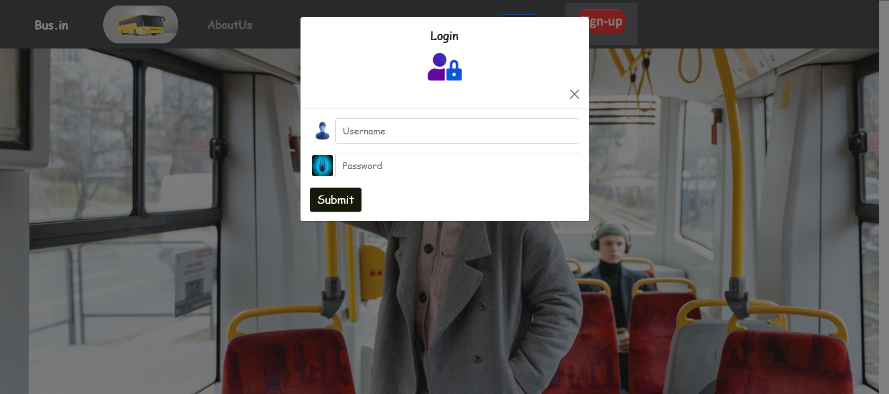
<br>
<br>
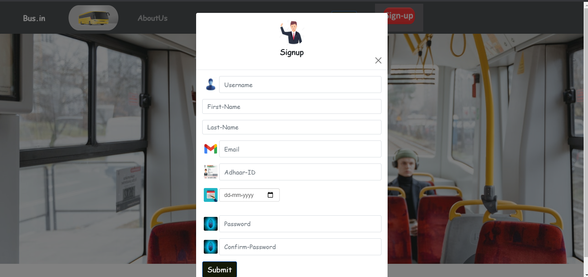
<br>
<br>
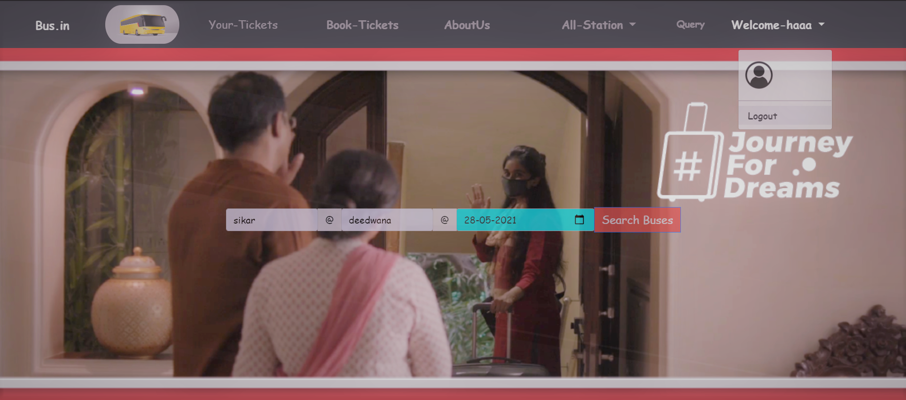
<br>
<br>

## <center>**Query**
### <center>There is a `Query` Section where user can `message` to us or `call` to us if user is in `emergency` and there is contact number for `tracking` of `bus`.</center>

<br>
<br>
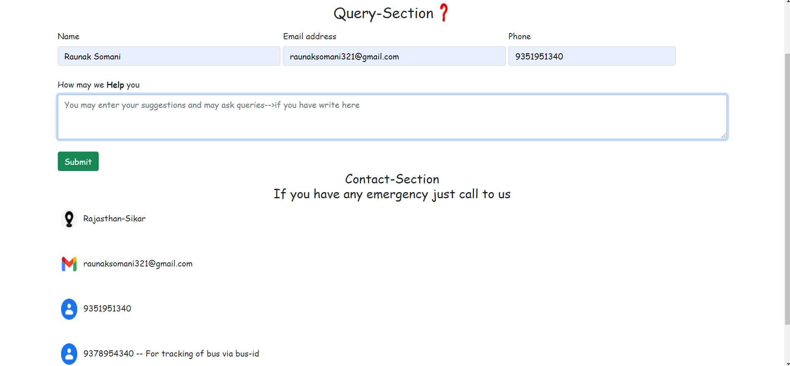

<br>
<br>

## <center>**Search-Bus** For `Booking-Tickets`

### <center>There is a `link` named **`Search Bus`** where user can enter his `origin` and `destination` state and if there is/are `bus` which routes are subroutes or routes which user want then he get all the bus otherwise he get a message saying that no bus with this route.</center>

<br>
<br>
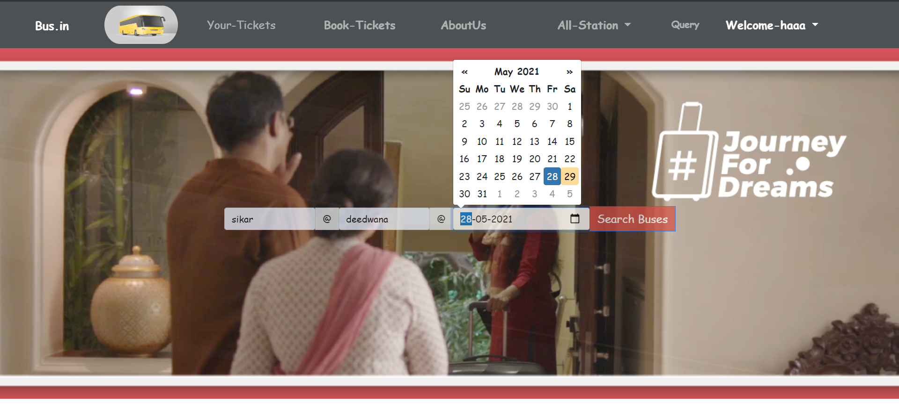
<br>
<br>


## <center>**Verification of Seats** In Bus Which User wants

### <center>After getting all the bus my app ask user to enter number of `tickets` the user wants.And if he tried to enter seats greater than the Available seats then he cant able to book tickets.He can able to book tickets only if there is enough seats are available such that his requirements are satisfied.</center>

<br>
<br>
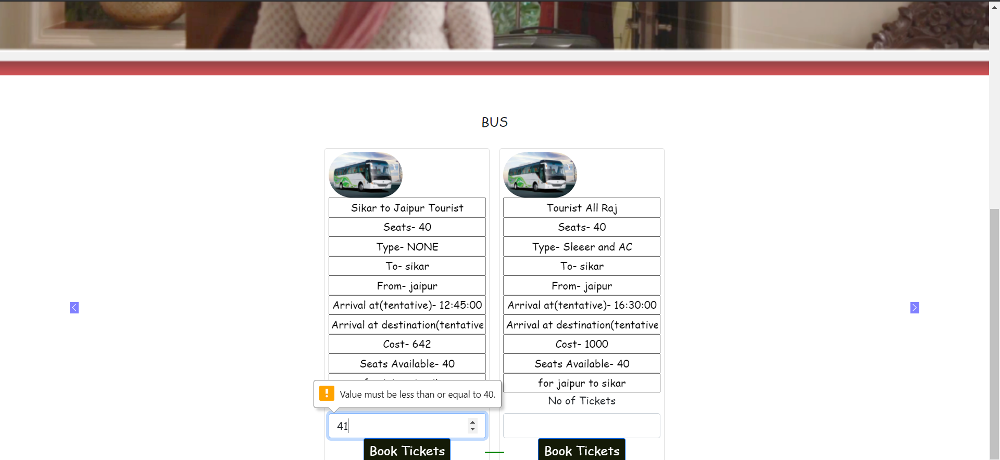
<br>
<br>

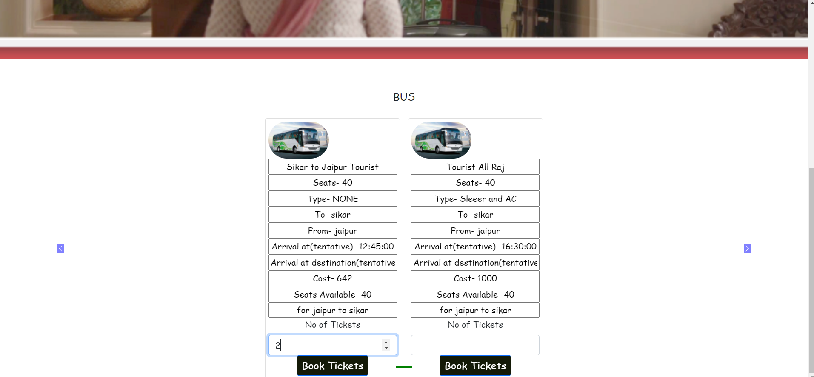

<br>
<br>

## <center>**Passenger-Info**

### <center>User have to `enter` all the `details` of each `passenger` which `gonna travel` through our bus.After submitting form he get an success message which signifies that his ticket/s is booked.</center>

<br>
<br>
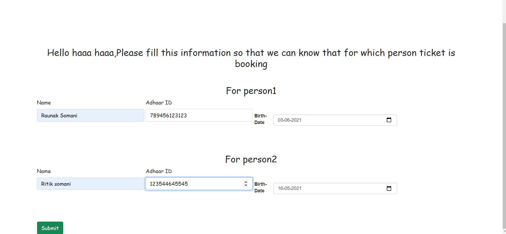

<br>
<br>

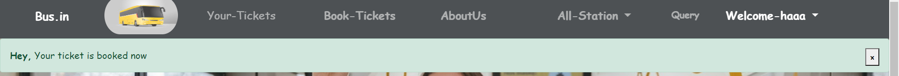

<br>
<br>

## <center>**Your-Tickets**

### <center>There is a `link` named `Your-Tickets` which gives user all his tickets which he **`booked`** till now.</center>

<br>
<br>
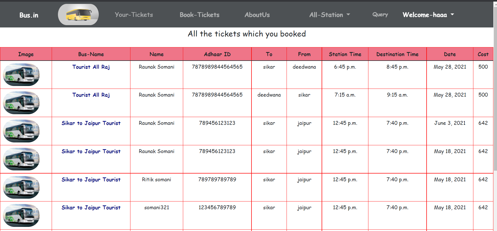

<br>
<br>

## <center>**Footer**

### <center>There is `footer` page of my website please have a `look`.</center>

<br>
<br>
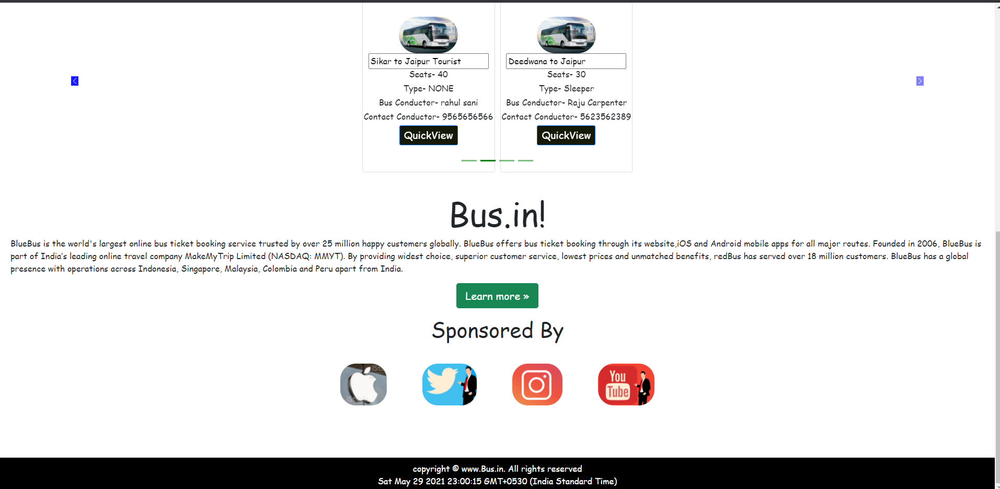

<br>
<br>


## <center>**My-Code**
<br>

### <center>There is some small part of my `models` and `views` code , have a look.</center>
<br>

```python-models

class Passenger(models.Model):
    pass_id = models.AutoField(primary_key = True)
    name = models.CharField(max_length =100)
    adhaarId = models.BigIntegerField()
    birth_date = models.DateField(default=date.today())

    def __str__(self):
        return " ".join([str(self.pass_id),self.name])


class Tickets(models.Model):
    ticket_id = models.AutoField(primary_key = True)
    passenger = models.ForeignKey('Passenger',on_delete=models.CASCADE)
    routes = models.ForeignKey('Routes',on_delete=models.CASCADE,default=1)
    trip = models.ForeignKey('TripDate',on_delete=models.CASCADE,default=1)
    ticketpassenger = models.ForeignKey("passengerTicket",on_delete=models.CASCADE,default=1)


```

```python-views

def index(request):
    busstand = BusStand.objects.values('name')
    bus = Bus.objects.all()
    n = len(bus)
    n_slides = n//2 + ceil((n/2)-(n//2))
    return render(request,'BusTracking/index.html',{"bus":bus,"range":range(1,n_slides),"busstand":busstand})

```
